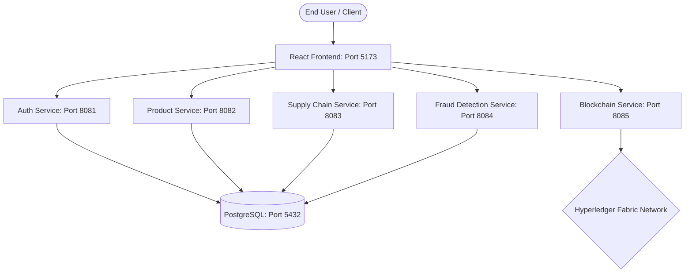

# ZeroFake: Anti-Counterfeiting Blockchain Platform

ZeroFake is a state-of-the-art decentralized supply chain verification and anti-counterfeiting solution. It leverages a microservices backend, a React-based glassmorphic frontend, and a Hyperledger Fabric blockchain ledger for immutable trace auditing.

---

## 1. Architecture Overview



* **Frontend**: React, Vite, TypeScript, Framer Motion, Tailwind CSS.
* **Backend Microservices**: 5 Java Spring Boot microservices, Spring Security (JWT), Spring Data JPA.
* **Database**: PostgreSQL (4 isolated databases).
* **Blockchain Ledger**: Hyperledger Fabric v2.5 Peer nodes and Orderer running on WSL2/Docker.

---

## 2. Deployment Guide

### Prerequisites
* **Java JDK 17** installed and configured in system path.
* **Node.js v18+** & **npm** installed.
* **Docker Desktop** installed and running.
* **WSL2 (Windows Subsystem for Linux)** with Ubuntu/Debian (required for Hyperledger Fabric test-network).
* **Go (Golang) v1.20+** installed inside WSL2 (for compiling chaincode).

---

### Step 1: Database Setup
1. Open your PostgreSQL database client (e.g. pgAdmin, DBeaver, or psql terminal).
2. Connect to your database server on port `5432` with username `postgres` and password `postgres`.
3. Create the four microservice databases:
   ```sql
   CREATE DATABASE zerofake_auth;
   CREATE DATABASE zerofake_product;
   CREATE DATABASE zerofake_fraud;
   CREATE DATABASE zerofake_supplychain;
   ```

---

### Step 2: Start Hyperledger Fabric Network (WSL2)
1. Launch **WSL2** terminal.
2. Clone/install `fabric-samples` in your home directory (`~/hyperledger/fabric-samples`).
3. Navigate to the test-network directory:
   ```bash
   cd ~/hyperledger/fabric-samples/test-network
   ```
4. Start the network, create a channel, and activate Certificate Authorities (CAs):
   ```bash
   ./network.sh down
   ./network.sh up createChannel -c mychannel -ca -s couchdb
   ```
5. Deploy the chaincode using the helper script in the ZeroFake root directory:
   ```bash
   # Run from WSL2
   ./deploy-chaincode.sh
   ```
   *This packages the Go chaincode, installs it on Org1 & Org2 peers, approves it, and commits it to `mychannel`.*

---

### Step 3: Run Backend Microservices
Run the following commands in separate terminal shells to start the Spring Boot microservices.

1. **Auth Service (Port 8081)**:
   ```powershell
   cd services/auth-service
   .\mvnw spring-boot:run
   ```
2. **Product Service (Port 8082)**:
   ```powershell
   cd services/product-service
   .\mvnw spring-boot:run
   ```
3. **Supply Chain Service (Port 8083)**:
   ```powershell
   cd services/supply-chain-service
   .\mvnw spring-boot:run
   ```
4. **Fraud Detection Service (Port 8084)**:
   ```powershell
   cd services/fraud-detection-service
   .\mvnw spring-boot:run
   ```
5. **Blockchain Service (Port 8085)**:
   ```powershell
   cd services/blockchain-service
   .\mvnw spring-boot:run
   ```

*Note: The services will automatically seed pre-defined admin/manufacturer users and compile off-chain schemas on startup.*

---

### Step 4: Run Frontend Application
1. Open a new terminal in the `zerofake-frontend` directory.
2. Install the node packages:
   ```bash
   npm install
   ```
3. Start the Vite development server:
   ```bash
   npm run dev
   ```
4. Open your browser and navigate to: `http://localhost:5173`

---

## 3. Production Deployment Notes

### Containerizing Frontend & Backends
To package the app for cloud environments (Kubernetes, AWS ECS, GCP):
1. **Dockerize Java Backends**: Add a `Dockerfile` using `eclipse-temurin:17-jre-alpine` for compact image sizing.
2. **Dockerize React Frontend**: Build the static bundle (`npm run build`) and serve it using an **Nginx** container.
3. **Kubernetes Orchestration**: Use Helm charts or manifest files to map environment configurations, secrets (JWT Key, DB credentials), and internal DNS routing.
