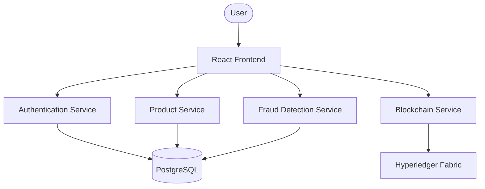

# ZeroFake – Blockchain-Based Anti-Counterfeiting & Supply Chain Verification Platform

ZeroFake is a decentralized platform designed to combat counterfeit products through secure product authentication, end-to-end supply chain traceability, and blockchain-backed verification. Built using a microservices architecture, it combines Spring Boot, React, PostgreSQL, and Hyperledger Fabric to provide a scalable and tamper-proof solution.

---

# Architecture Overview



### Tech Stack

**Backend**

* Java
* Spring Boot
* Spring Security (JWT)
* Spring Data JPA
* OpenFeign

**Frontend**

* React
* Vite
* TypeScript
* Tailwind CSS
* Framer Motion

**Database**

* PostgreSQL

**Blockchain**

* Hyperledger Fabric
* Fabric Gateway Java SDK
* Go (Chaincode)

---

# Key Features

* Secure authentication with JWT and Role-Based Access Control (RBAC)
* Product registration with QR code generation
* Blockchain-backed product registration and ownership tracking
* Immutable audit trail for supply chain events
* Real-time product verification
* Rule-based fraud detection with dynamic risk scoring
* Modern, responsive dashboard with analytics and QR scanning

---

# Getting Started

## Prerequisites

* Java JDK 17+
* Node.js 18+
* PostgreSQL
* Docker Desktop
* WSL2 (for Hyperledger Fabric)
* Go (for building chaincode)

## Installation

### 1. Clone the repository

```bash
git clone <repository-url>
cd ZeroFake
```

### 2. Configure the environment

Create the required PostgreSQL databases and update the application configuration files with your local database credentials.

### 3. Start Hyperledger Fabric

Initialize the Hyperledger Fabric test network and deploy the provided chaincode.

### 4. Run the backend services

Start each Spring Boot microservice.

### 5. Run the frontend

```bash
npm install
npm run dev
```

Open the application in your browser.

---

# Project Structure

```
Frontend (React)
        │
        ├── Authentication Service
        ├── Product Service
        ├── Blockchain Service
        └── Fraud Detection Service
                │
                ├── PostgreSQL
                └── Hyperledger Fabric
```

---

# Future Enhancements

* Mobile application
* Multi-organization blockchain deployment
* AI-assisted fraud detection
* Cloud-native deployment
* Real-time notifications
* Analytics dashboard enhancements

---

# License

This project is intended for educational and demonstration purposes.

---

If you found this project interesting, consider giving the repository a ⭐.
