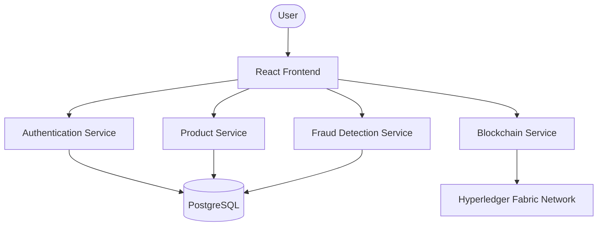

# 🛡️ ZeroFake

> A Blockchain-Based Anti-Counterfeiting & Supply Chain Verification Platform built with Spring Boot Microservices, React, and Hyperledger Fabric.

ZeroFake is a decentralized platform designed to combat counterfeit products by combining blockchain technology with a modern microservices architecture. It enables secure product registration, end-to-end supply chain traceability, immutable ownership records, and intelligent fraud detection through QR-based product verification.

---

## 🚀 Features

- 🔐 JWT-based Authentication & Role-Based Access Control (RBAC)
- 📦 Product Registration & QR Code Generation
- 🔗 Blockchain-backed Product Registration & Ownership Tracking
- 📜 Immutable Audit Trail using Hyperledger Fabric
- ✅ Real-time Product Verification
- 🚨 Rule-based Fraud Detection & Dynamic Risk Scoring
- 📊 Interactive Analytics Dashboard
- 📱 Mobile-friendly QR Code Scanner
- 🏗️ Scalable Spring Boot Microservices Architecture

---

## 🏛️ System Architecture



---

## 🛠️ Tech Stack

### Backend
- Java
- Spring Boot
- Spring Security (JWT)
- Spring Data JPA (Hibernate)
- Spring Cloud OpenFeign

### Frontend
- React
- Vite
- TypeScript
- Tailwind CSS
- Framer Motion
- Lucide React

### Database
- PostgreSQL

### Blockchain
- Hyperledger Fabric
- Fabric Gateway Java SDK
- Go (Chaincode)

---

## ⚙️ Getting Started

### Prerequisites

- Java JDK 17+
- Node.js 18+
- PostgreSQL
- Docker Desktop
- WSL2 (for Hyperledger Fabric)
- Go (for Chaincode)

### Installation

Clone the repository:

```bash
git clone https://github.com/<your-username>/ZeroFake.git
cd ZeroFake
```

Configure the required environment variables and database settings for your local machine.

Start the Hyperledger Fabric network and deploy the provided chaincode.

Run the backend services.

Start the frontend:

```bash
npm install
npm run dev
```

Open the application in your browser.

---

## 📂 Project Structure

```
ZeroFake
│
├── frontend/
├── auth-service/
├── product-service/
├── blockchain-service/
├── fraud-detection-service/
├── chaincode/
└── docs/
```

---

## 🎯 Core Capabilities

- Secure authentication and authorization
- Product lifecycle management
- Blockchain-based ownership tracking
- Product authenticity verification
- Counterfeit detection using intelligent verification rules
- Immutable transaction history
- Modern analytics dashboard

---

## 🔮 Future Enhancements

- AI-powered fraud detection
- Multi-organization Fabric network
- Mobile application
- Cloud-native deployment
- Real-time notifications
- Advanced analytics & reporting

---

## 📄 License

This project is licensed under the **Apache License 2.0**.

See the [LICENSE](LICENSE) file for details.

---

## ⭐ Support

If you found this project interesting, consider giving it a **Star ⭐** on GitHub.

Contributions, suggestions, and feedback are always welcome!
