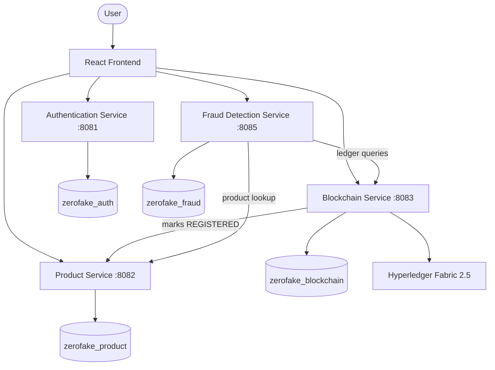

# 🛡️ ZeroFake

> A blockchain-based anti-counterfeiting and supply chain verification platform, built with Spring Boot microservices, React and Hyperledger Fabric.

ZeroFake gives every manufactured product a unique identity anchored on a Hyperledger Fabric ledger. Anyone can scan the product's QR code and get an answer to a single question: **is this real?**

The answer is not taken on trust from a label. It is checked against an immutable ledger, cross-referenced with the product catalogue, and run through a rule-based fraud engine that looks at who has scanned the item, where, and how often.

---

## 🚀 Features

- 🔐 JWT authentication with role-based access control enforced in **every** service
- 📦 Product, category and batch management with QR code generation
- 🔗 Product identity anchored on Hyperledger Fabric
- 📜 Immutable ownership history via Fabric's history API
- ✅ Real-time authenticity verification
- 🚨 Seven-rule fraud engine with risk scoring
- 📊 Role-aware analytics dashboard
- 📱 Browser-based QR scanner
- 🐳 Full Docker Compose deployment

---

## 🏛️ Architecture


```mermaid
graph TD
    User([User]) --> Frontend[React Frontend]

    Frontend --> Auth["Authentication Service :8081"]
    Frontend --> Product["Product Service :8082"]
    Frontend --> Blockchain["Blockchain Service :8083"]
    Frontend --> Fraud["Fraud Detection Service :8085"]

    Blockchain -->|marks REGISTERED| Product
    Fraud -->|product lookup| Product
    Fraud -->|ledger queries| Blockchain

    Auth --> AuthDB[(zerofake_auth)]
    Product --> ProductDB[(zerofake_product)]
    Blockchain --> BlockchainDB[(zerofake_blockchain)]
    Fraud --> FraudDB[(zerofake_fraud)]

    Blockchain --> Fabric[Hyperledger Fabric 2.5]
```

### Service boundaries

| Service | Owns | Never touches |
|---|---|---|
| **auth** `:8081` | Users, roles, JWT issuance, refresh tokens | Products, ledger |
| **product** `:8082` | Catalogue, categories, batches, QR codes | Ledger, users, fraud rules |
| **blockchain** `:8083` | Fabric gateway, chaincode calls, transaction audit trail | Product CRUD, users, fraud rules |
| **fraud** `:8085` | Verification, fraud rules, risk scoring, scan history | Fabric directly — always via the blockchain service |

**Authentication model.** The authentication service is the only issuer of tokens. It signs an HS256 JWT carrying `userId` and `role` claims. Every other service validates that token locally against the shared secret and authorises from the `role` claim — no network call, no shared session store.

**Service-to-service calls** propagate the caller's bearer token. No service holds an ambient privilege of its own, so a downstream service applies exactly the authorisation it would for a direct call.

---

## 🛠️ Tech Stack

**Backend** — Java 21 · Spring Boot 3.5 · Spring Security 6 · Spring Data JPA · Spring Cloud OpenFeign · MapStruct · Lombok · springdoc-openapi

**Frontend** — React 19 · Vite · TypeScript · Tailwind CSS v4 · React Router · Axios · Framer Motion · Chart.js · html5-qrcode

**Data** — PostgreSQL 16 (one database per service)

**Blockchain** — Hyperledger Fabric 2.5 LTS · Fabric Gateway Java client 1.11 · Go chaincode on Contract API v2

**Deployment** — Docker · Docker Compose

---

## ⚙️ Getting Started

### Prerequisites

- Docker Desktop
- A running Hyperledger Fabric network (`fabric-samples` test-network), with Go installed for the chaincode
- On Windows, WSL2 for the Fabric network

For running the services outside Docker you also need JDK 21, Node.js 20+ and PostgreSQL 16.

### 1. Configure

```bash
cp .env.example .env
```

Set two values in `.env`:

```bash
openssl rand -base64 64 | tr -d '[:space:]'    # paste into JWT_SECRET
```

- `JWT_SECRET` — shared signing key. Compose refuses to start without it.
- `FABRIC_CRYPTO_PATH` — absolute path to your network's `.../peerOrganizations/org1.example.com` directory.

### 2. Start Fabric and deploy the chaincode

Bring up the test-network with a channel named `mychannel`, then:

```bash
FABRIC_SAMPLES=~/hyperledger/fabric-samples ./deploy-chaincode.sh
```

Redeploying a change to an already-committed chaincode needs a new version *and* sequence:

```bash
CHAINCODE_VERSION=1.1 CHAINCODE_SEQUENCE=2 ./deploy-chaincode.sh
```

### 3. Start ZeroFake

```bash
docker compose up --build
```

| Surface | URL |
|---|---|
| Web app | http://localhost:3000 |
| Auth API docs | http://localhost:8081/swagger-ui.html |
| Product API docs | http://localhost:8082/swagger-ui.html |
| Blockchain API docs | http://localhost:8083/swagger-ui.html |
| Fraud API docs | http://localhost:8085/swagger-ui.html |

### Demonstration accounts

One account is seeded per role, all sharing `SEED_DEFAULT_PASSWORD` (default `Password123!`):

`admin@` · `manufacturer@` · `warehouse@` · `distributor@` · `retailer@` · `customer@` — all `@zerofake.com`.

Set `SEED_ENABLED=false` to disable seeding.

### 4. Verify it works

```bash
./scripts/smoke-test.sh
```

Exercises the running stack over HTTP — login, RBAC refusals, catalogue writes, QR download, and the counterfeit verdict — asserting on real responses. Steps needing a live Fabric peer are reported as skipped, not passed, when the peer is unreachable.

### Running the test suites

```bash
cd services/auth-service && ./mvnw test
```

73 tests across the four services. The context tests run against in-memory H2, so no database is required:

| Suite | Covers |
|---|---|
| `FraudAssessmentTest` | Risk weights, score capping, severity ordering |
| `VerificationServiceImplTest` | The whole verification workflow with mocked clients — including that an unverifiable product is *reported* as counterfeit rather than throwing, and that a dependency outage is **not** reported as counterfeit |
| `ChaincodeErrorsTest` | Telling "not on the ledger" (→ 404) apart from "peer unreachable" (→ 502) |
| `JwtServiceTest` | The `userId`/`role` claim contract, issuer and signature rejection |
| `QrCodeServiceImplTest` | QR payload is the product id alone; path traversal is refused |

### Running without Docker

Every setting has a working localhost default, so each service starts with:

```bash
cd services/auth-service && ./mvnw spring-boot:run
```

Create the four databases first: `zerofake_auth`, `zerofake_product`, `zerofake_blockchain`, `zerofake_fraud`.

---

## 🔄 How verification works

1. A customer scans the QR code, which encodes the product's UUID and nothing else.
2. The fraud service looks the product up in the catalogue. **Not found → counterfeit**, risk 100.
3. It reads the product's state from the ledger via the blockchain service. **No on-chain identity → blockchain mismatch**, risk 100.
4. It evaluates the remaining rules against scan history, on-chain ownership and batch expiry.
5. Scan history and a verification log are written. At risk ≥ 80 a fraud report is raised automatically.

### Fraud rules

| Rule | Risk | Fires when |
|---|---|---|
| `PRODUCT_NOT_FOUND` | 100 | No catalogue record exists |
| `BLOCKCHAIN_MISMATCH` | 100 | Catalogued, but absent from the ledger |
| `INVALID_OWNER` | 40 | A supply chain role scans goods it does not hold on-chain |
| `MULTIPLE_LOCATION_SCAN` | 35 | The same item has been seen in another location |
| `DUPLICATE_QR` | 30 | The same code has been scanned by another party |
| `SUSPICIOUS_ACTIVITY` | 15 | Five or more scans within ten minutes |
| `EXPIRED_PRODUCT` | 25 | Every batch of the product is past its expiry date |

Scores accumulate and are capped at 100. **≥ 80 → counterfeit · ≥ 20 → suspicious · otherwise genuine.** When several rules fire, the most severe becomes the headline finding.

Verification is read-only with respect to the supply chain. Scanning an item never transfers its ownership — inspection and custody are different acts, and conflating them would let anyone take ownership of anything by pointing a camera at it. Transfers are performed explicitly by the party handing the goods on.

---

## 📂 Project Structure

```
ZeroFake
│
├── docker-compose.yml
├── deploy-chaincode.sh
├── .env.example
│
├── docker/
│   └── postgres/init-databases.sh
│
├── services/
│   ├── auth-service/
│   ├── product-service/
│   ├── blockchain-service/
│   ├── fraud-detection-service/
│   └── zerofake-chaincode/          # Go chaincode
│
└── zerofake-frontend/
```

---

## 📖 Documentation

[**docs/ZeroFake-Interview-Guide.pdf**](docs/ZeroFake-Interview-Guide.pdf) — a 38-page guide covering the architecture, every workflow end to end, the core concepts from first principles (JWT, Spring, JPA, blockchain, Hyperledger Fabric, Docker), the design decisions and their trade-offs, a security analysis, known limitations, and a question bank with model answers.

Regenerate it after changing the content files with:

```bash
python docs/build_guide.py
```

## 📐 Design notes

**The ledger is the source of truth, and the audit trail says only what the ledger says.** Transaction identifiers and block numbers are read from Fabric; nothing is synthesised. When a transaction fails, it is recorded as `FAILED` with the real proposal identifier and the chaincode's own error, rather than being smoothed over.

**A QR code is a pointer, not a proof.** It encodes the product identifier alone. A counterfeiter can copy a QR code trivially — which is precisely why every scan is verified against the ledger, and why duplicate-scan detection exists.

**Fabric identity is a static X.509 credential** read from the network's crypto material, not enrolled through Fabric CA. This suits a single-organisation demonstration network. A multi-organisation deployment would need CA enrolment and wallet management.

**`blockHash` is always null.** The Fabric Gateway client exposes the block number for a committed transaction but not the block hash; obtaining it requires a block event listener. The column is retained for that future capability rather than being filled with a placeholder.

---

## 🔮 Future Enhancements

- Fabric CA enrolment and wallet management
- Multi-organisation Fabric network
- Block event listener to populate block hashes
- ML-assisted fraud detection alongside the rule engine
- Native mobile scanner app

---

## 📄 License

Licensed under the **Apache License 2.0**. See [LICENSE](LICENSE).

---

## ⭐ Support

If you found this project interesting, consider giving it a **Star ⭐** on GitHub. Contributions, suggestions and feedback are always welcome.
